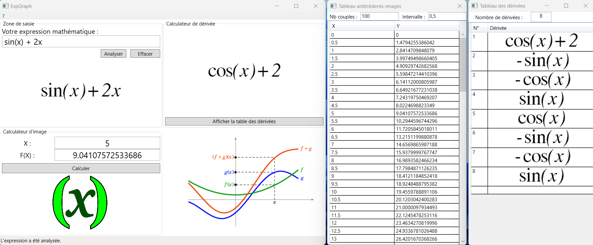

# Math Functions Analyzer in C# with a WPF UI

Compute function images and derivatives. Built in C# with a WPF (Windows Presentation Foundation) UI.

The executable is `bin/ui.exe`. Your antivirus may incorrectly label the executable as a malware.

